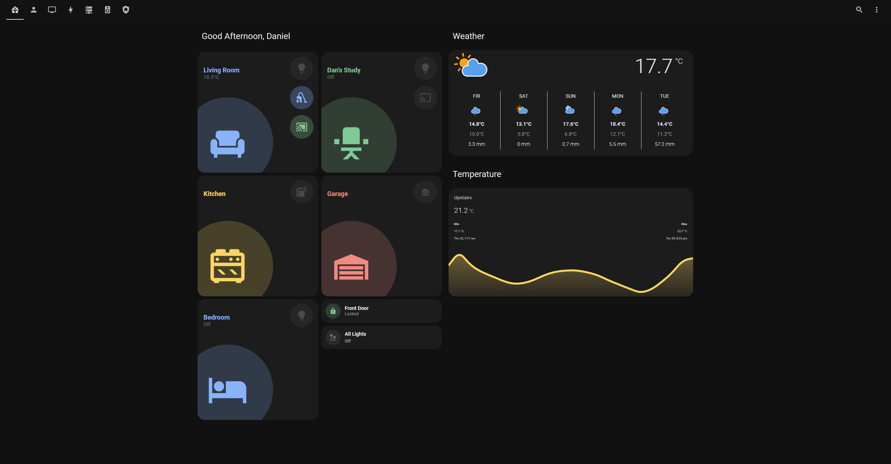
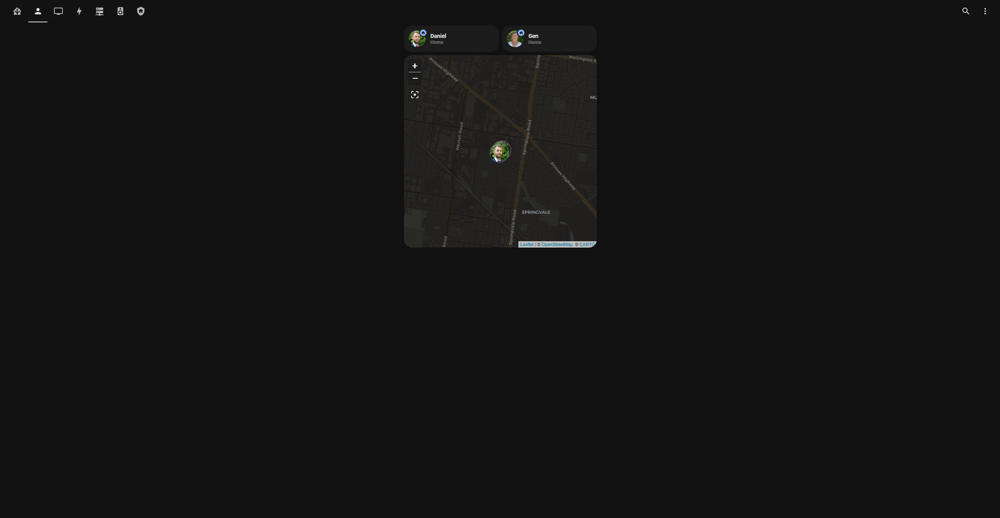
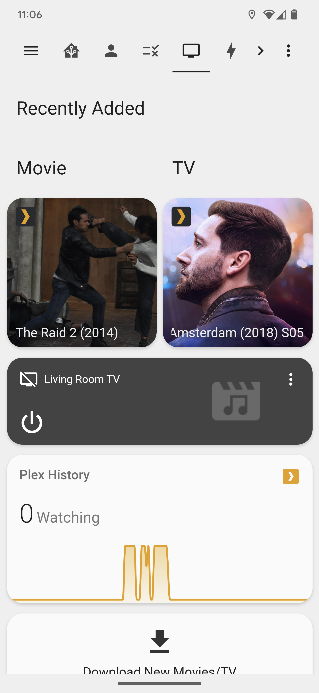
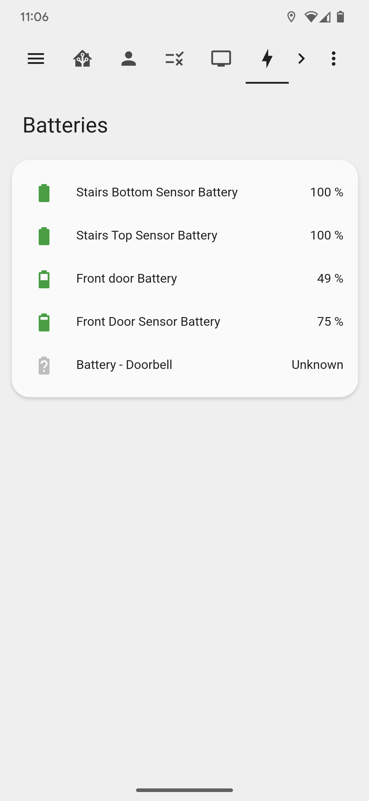
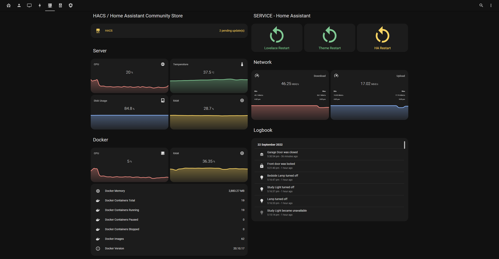
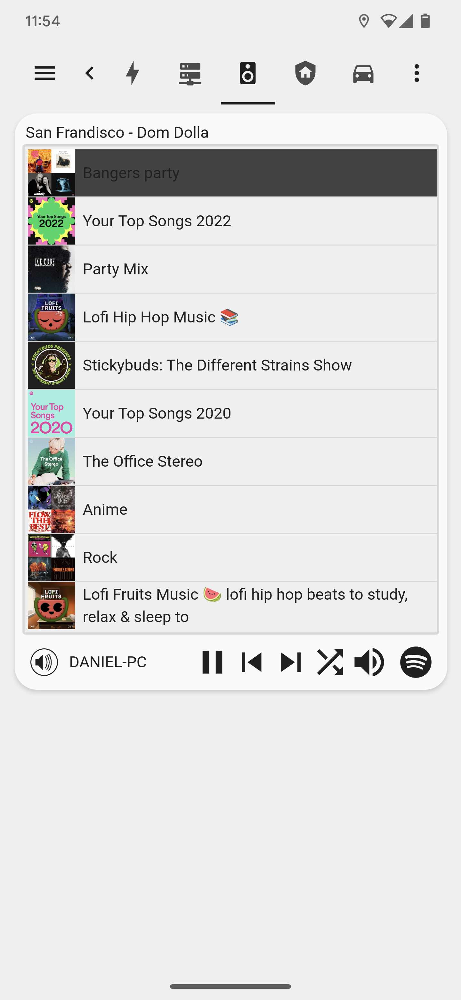
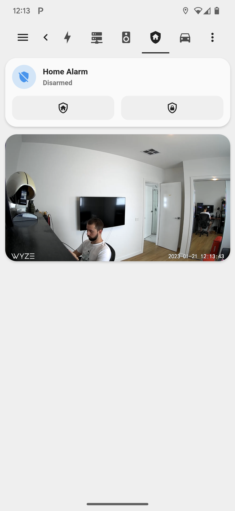
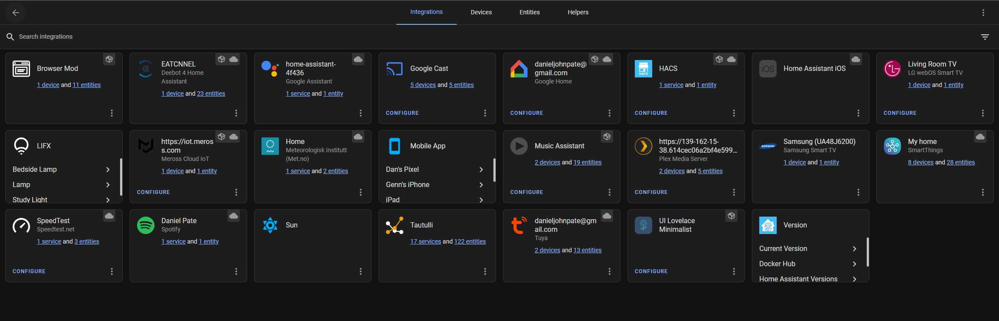

- [1. Hardware](#1-hardware)
- [2. Screenshots](#2-screenshots)
- [3. Other Links](#3-other-links)

## 1. Hardware

| Vendor  | Product         | Integration                                                                          | Description                              | Location    |
| ------- | --------------- | ------------------------------------------------------------------------------------ | ---------------------------------------- | ----------- |
| LIFX    | Mini White      | [LIFX](https://www.home-assistant.io/integrations/lifx)                              | Light bulb                               | Lounge Room |
| LIFX    | White           | [LIFX](https://www.home-assistant.io/integrations/lifx)                              | Light bulb                               | Bed Room    |
| LIFX    | White           | [LIFX](https://www.home-assistant.io/integrations/lifx)                              | Light bulb                               | Dan's Study |
| Ecovacs | Deebot T9       | [Deebot 4 Home Assistant](https://github.com/DeebotUniverse/Deebot-4-Home-Assistant) | Vacuum                                   | Lounge Room |
| Google  | Home Hub        | [Google Home](https://github.com/leikoilja/ha-google-home)                           | Smart screen                             | Kitchen     |
| LG      | C1              | [LG webOS Smart TV](https://www.home-assistant.io/integrations/webostv)              | TV                                       | Lounge Room |
| Meross  | msg100          | [Meross HomeAssistant](https://github.com/albertogeniola/meross-homeassistant)       | Garage door opener                       | Garage      |
| Samsung | UA48J6200       | [Samsung Smart TV](https://www.home-assistant.io/integrations/samsungtv)             | TV                                       | Dan's Study |
| Yale    | Assure Lock     | [SmartThings](https://www.home-assistant.io/integrations/smartthings)                | Door lock                                | Front Door  |
| Aeotec  | Contact Sensor  | [SmartThings](https://www.home-assistant.io/integrations/smartthings)                | Door sensor                              | Front Door  |
| Samsung | Washing Machine | [SmartThings](https://www.home-assistant.io/integrations/smartthings)                | Washing machine                          | Laundry     |
| Aeotec  | Nano            | [SmartThings](https://www.home-assistant.io/integrations/smartthings)                | Light switch                             | Stairs      |
| Aeotec  | Triple Sensor   | [SmartThings](https://www.home-assistant.io/integrations/smartthings)                | 2x temperature, light and motion sensors | Stairs      |
| ALDI    | Doorbell        | [Tuya](https://www.home-assistant.io/integrations/tuya/)                             | Smart video doorbell                     | Front Door  |
| K Mart  | Kettle          | [Tuya](https://www.home-assistant.io/integrations/tuya/)                             | Smart kettle                             | Kitchen     |

## 2. Screenshots

## 3. Other Links

[Lovelace Config Inspiration](https://github.com/matt8707/hass-config)
