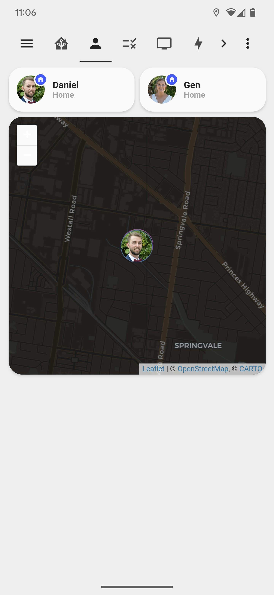
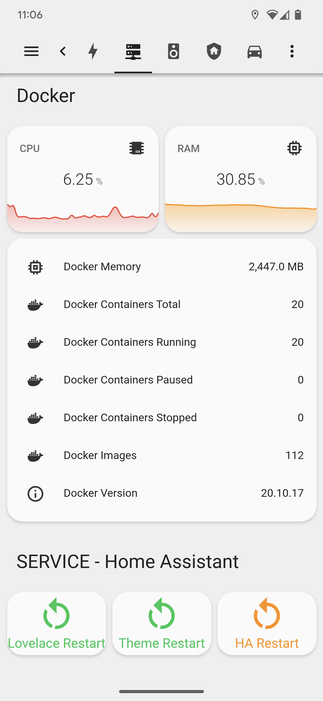
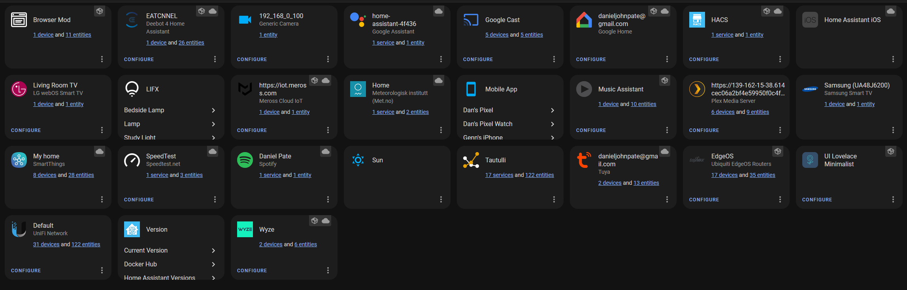

- [1. Hardware](#1-hardware)
- [2. Screenshots](#2-screenshots)
- [3. Other Links](#3-other-links)

## 1. Hardware

| Description                              | Vendor  | Product         | Integration                                                                          | Location    |
| ---------------------------------------- | ------- | --------------- | ------------------------------------------------------------------------------------ | ----------- |
| Light bulb                               | LIFX    | Mini White      | [LIFX](https://www.home-assistant.io/integrations/lifx)                              | Lounge Room |
| Light bulb                               | LIFX    | White           | [LIFX](https://www.home-assistant.io/integrations/lifx)                              | Bed Room    |
| Light bulb                               | LIFX    | White           | [LIFX](https://www.home-assistant.io/integrations/lifx)                              | Dan's Study |
| Vacuum                                   | Ecovacs | Deebot T9       | [Deebot 4 Home Assistant](https://github.com/DeebotUniverse/Deebot-4-Home-Assistant) | Lounge Room |
| Smart screen                             | Google  | Home Hub        | [Google Home](https://github.com/leikoilja/ha-google-home)                           | Kitchen     |
| TV                                       | LG      | C1              | [LG webOS Smart TV](https://www.home-assistant.io/integrations/webostv)              | Lounge Room |
| Garage door opener                       | Meross  | msg100          | [Meross HomeAssistant](https://github.com/albertogeniola/meross-homeassistant)       | Garage      |
| TV                                       | Samsung | UA48J6200       | [Samsung Smart TV](https://www.home-assistant.io/integrations/samsungtv)             | Dan's Study |
| Door lock                                | Yale    | Assure Lock     | [SmartThings](https://www.home-assistant.io/integrations/smartthings)                | Front Door  |
| Door sensor                              | Aeotec  | Contact Sensor  | [SmartThings](https://www.home-assistant.io/integrations/smartthings)                | Front Door  |
| Washing machine                          | Samsung | Washing Machine | [SmartThings](https://www.home-assistant.io/integrations/smartthings)                | Laundry     |
| Light switch                             | Aeotec  | Nano            | [SmartThings](https://www.home-assistant.io/integrations/smartthings)                | Stairs      |
| 2x temperature, light and motion sensors | Aeotec  | Triple Sensor   | [SmartThings](https://www.home-assistant.io/integrations/smartthings)                | Stairs      |
| Smart video doorbell                     | ALDI    | Doorbell        | [Tuya](https://www.home-assistant.io/integrations/tuya/)                             | Front Door  |
| Smart kettle                             | K Mart  | Kettle          | [Tuya](https://www.home-assistant.io/integrations/tuya/)                             | Kitchen     |

## 2. Screenshots

## 3. Other Links

[Lovelace Config Inspiration](https://github.com/matt8707/hass-config)
